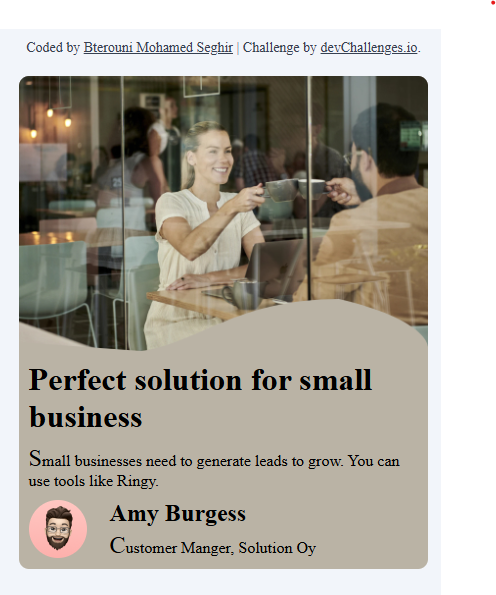

<h1 align="center">Business Blog Card | devChallenges</h1>

   Solution for a challenge <a href="https://devchallenges.io/challenge/business-blog-card" target="_blank">Business Blog Card</a> from <a href="http://devchallenges.io" target="_blank">devChallenges.io</a>.

  <h3>
    <a href="https://betrounimohamedseghir.github.io/business-blog-card/">
      Demo
    </a>
     | 
    <a href="https://github.com/BetrouniMohamedSeghir/business-blog-card
    ">
      Solution
    </a>
     | 
    <a href="https://devchallenges.io/challenge/business-blog-card">
      Challenge
    </a>
  </h3>

<!-- TABLE OF CONTENTS -->

## Table of Contents

- [Overview](#overview)
  - [What I learned](#what-i-learned)
  - [Useful resources](#useful-resources)
- [Built with](#built-with)
- [Features](#features)
- [Contact](#contact)
- [Acknowledgements](#acknowledgements)

<!-- OVERVIEW -->

## Overview

### What I learned

- How to use flexbox and grid .
- Upload the project to GitHub and link it to remote.

### Useful resources

- [resource 1](https://chatgpt.com/c) - This helped me for git commands.
- [resource 2](https://www.youtube.com/@ElzeroWebSchool) - This also helped me for git commands.
- [resource 3](https://www.freecodecamp.org) - This helped me for flexbox and grid.

### Built with

<!-- This section should list any major frameworks that you built your project using. Here are a few examples.-->

- Semantic HTML5 markup
- CSS custom properties
- Flexbox
- CSS Grid

## Features

- Responsive design.
- Top image with content inside a container.
- Colors and fonts consistent with the challenge.
- colors contrast.

This application/site was created as a submission to a [DevChallenges](https://devchallenges.io/challenges-dashboard) challenge.

## Author

- GitHub [@BetrouniMohamedSeghir](https://github.com/BetrouniMohamedSeghir)

